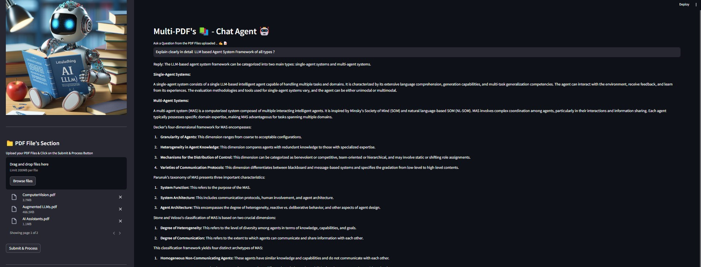
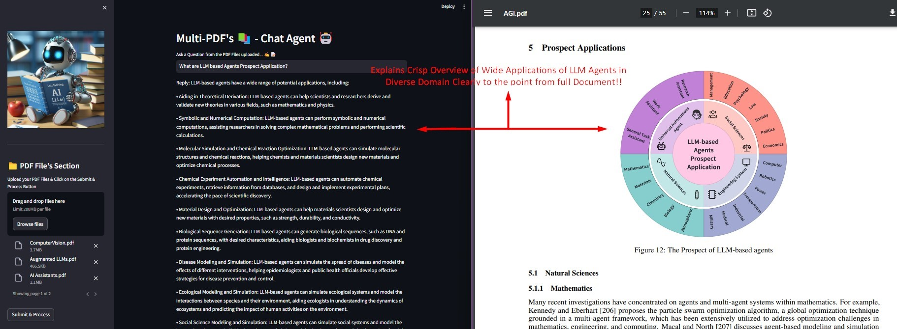
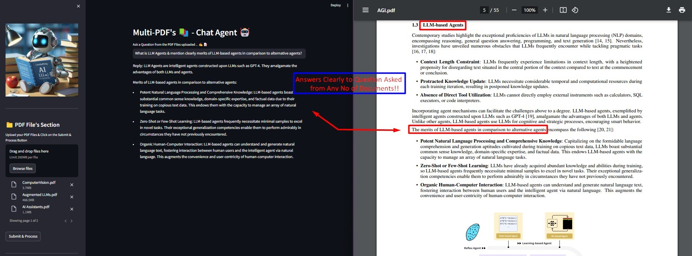

# Multi-PDFs ChatApp AI Agent 🤖

Meet **MultiPDF Chat AI App**! 🚀 Interact seamlessly with multiple PDFs using **Langchain, Google Gemini Pro & FAISS Vector DB**, all deployed effortlessly on **Streamlit**. Get **instant, accurate responses** powered by Google's advanced **Gemini AI model**. 📚💬 **Enhance your PDF experience today!** 🔥✨

## 📝 Description
The **Multi-PDF Chat AI Agent** is a **Streamlit-based** web application designed to enable interactive conversations with a chatbot. This application allows users to upload multiple **PDF documents**, extract **text data**, and utilize **AI-powered responses** based on the extracted content. It offers a smooth, intuitive experience for **document-based Q&A**.

## 📢 Demo App with Streamlit Cloud (Preview Only)

## 💻 Demo:


## 🎯 How It Works:
------------


The application follows these steps to process and answer your queries:

1. **PDF Loading**: Upload multiple PDFs, and the app extracts their textual content.
2. **Text Chunking**: The extracted text is divided into smaller chunks for efficient processing.
3. **Language Model Processing**: AI models convert these text chunks into meaningful embeddings.
4. **Similarity Matching**: User queries are compared with extracted data to find the best-matching segments.
5. **AI-Powered Response Generation**: The selected chunks are used by **LLM models** to generate accurate responses.



---
## 🌟 Key Features

- **Smart Text Chunking**: Dynamic sliding-window chunking for optimal information retrieval.
- **Multi-Document Q&A**: Ask questions across multiple PDFs simultaneously.
- **File Compatibility**: Supports **PDF** and **TXT** files.
- **AI Model Flexibility**: Works with **Google Gemini Pro, OpenAI GPT-3, Anthropic Claude, Llama2**, and other **open-source LLMs**.
- **Efficient Vector Search**: Uses **FAISS** for fast similarity search and retrieval.
- **User-Friendly UI**: Built with **Streamlit** for a seamless user experience.



## 📌 Tech Stack

- **Streamlit** – Interactive web app framework.
- **Google Gemini AI** – AI-powered conversational model.
- **LangChain** – Natural Language Processing framework.
- **PyPDF2** – PDF text extraction.
- **FAISS** – Efficient similarity search.
- **Python-dotenv** – Secure API key handling.

---
## ▶️ Installation Guide

1. **Clone the repository:**
   ```bash
   git clone https://github.com/AnshulGitHub/Multi-PDFs_ChatApp_AI-Agent.git
   ```
2. **Install dependencies:**
   ```bash
   pip install -r requirements.txt
   ```
3. **Set up API keys:**
   - Get your **Google API Key** from [Makersuite](https://makersuite.google.com/app/apikey)
   - Create a `.env` file in the project root and add:
     ```bash
     GOOGLE_API_KEY=<your-api-key-here>
     ```
4. **Run the Streamlit app:**
   ```bash
   streamlit run app.py
   ```

---
## 💡 Usage Instructions

To interact with **Multi-PDF Chat AI**, follow these steps:

1. Upload multiple PDFs via the sidebar.
2. Click **"Process"** to extract text data.
3. Enter your queries in the chat input field.
4. The AI chatbot will provide relevant answers based on the uploaded documents.


